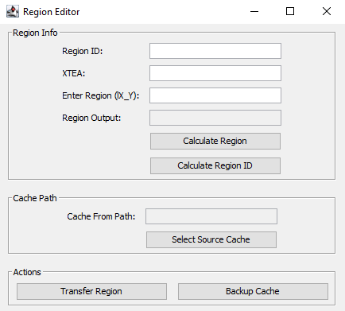
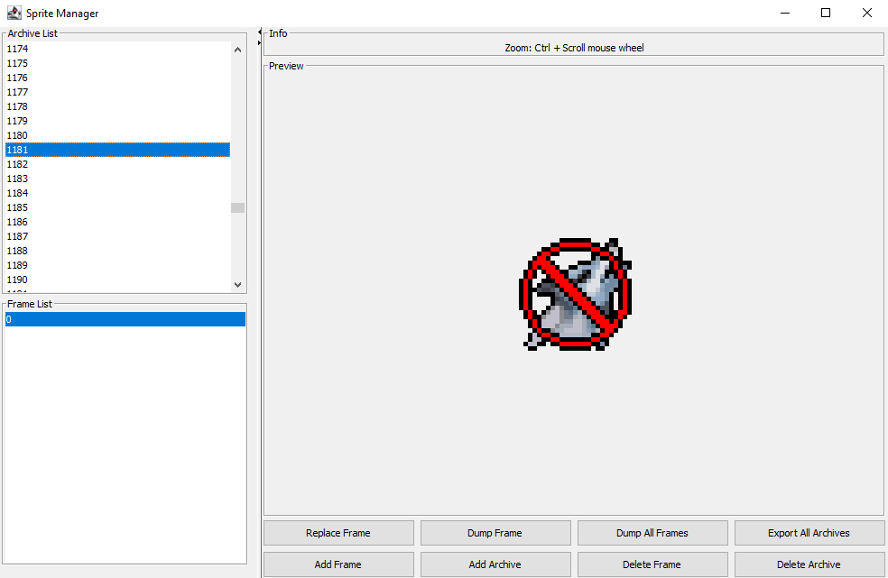
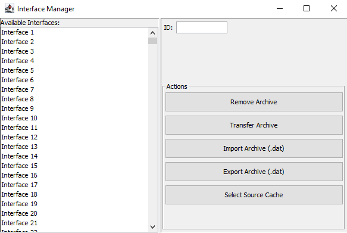
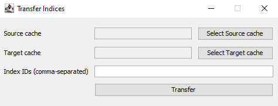
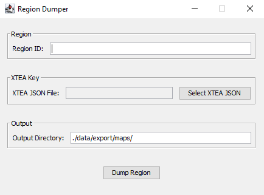
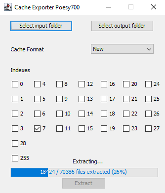

## Tools:

## Region Transfer

***



The RegionTransfer tool allows you to transfer individual map regions between caches, and calculate region filenames or IDs. It supports specifying the source and target cache paths, managing XTEA encryption keys for decryption/encryption, and backing up the cache as a ZIP archive.

***

- **Region ID:** Enter the numeric region ID.
- **XTEA:** Enter the XTEA key as comma-separated integers used to decrypt/encrypt region data or ```0,0,0,0```
- **Enter Region (lX_Y):** Enter the region filename format (lX_Y) for calculating the region ID.
- **Region Output:** Displays the calculated region filename (lX_Y) based on the region ID.
- **Calculate Region:** Button to convert the Region ID into the region filename (sets the Region Output field).
- **Calculate Region ID:** Button to convert the region filename (lX_Y) into the numeric Region ID (sets the Region ID field).
- **Cache From Path:** Displays the source cache directory path.
- **Select Source Cache:** Button to open a directory chooser to select the source cache folder.
- **Transfer Region:** Transfers the selected region from the source cache to the target cache using the specified XTEA keys.
- **Backup Cache:** Creates a ZIP backup of the cache directory (source cache if specified; otherwise the target cache).

## How to Use

1. **Select Source Cache**  
   Click **Select Source Cache** and choose the folder of the source cache you want to transfer regions from.  
   The path will be displayed in the **Cache From Path** field.

2. **Enter Region ID and XTEA Key**  
   Input the numeric **Region ID** you want to transfer.  
   Enter the XTEA key as comma-separated integers in the **XTEA** field (e.g., `12345,67890,13579,24680`).

3. **Calculate Region Filename or ID (Optional)**
    - To calculate the region filename (`lX_Y`) from the Region ID, click **Calculate Region**; the result shows in **Region Output**.
    - To calculate the Region ID from a region filename (`lX_Y`), enter the value in **Enter Region (lX_Y)** and click **Calculate Region ID**; the numeric ID will be set in **Region ID**.

4. **Transfer Region**  
   Click **Transfer Region** to copy the region data from the source cache to the target cache.  
   If the region exists in the source cache and the XTEA keys are correct, the transfer will succeed with a confirmation message.  
   If not found or invalid inputs, an error will be shown.

5. **Backup Cache**  
   Click **Backup Cache** to create a ZIP archive backup of the cache.  
   If a source cache path is set, that folder is backed up; otherwise, the target cache is backed up.  
   The ZIP file is saved as `cache_backup.zip` inside the chosen cache directory.  
   A success or error message will appear after completion.

***

# Sprite Manager

***



SpriteManager is a application to manage sprite archives in a game cache.  
It allows viewing, replacing, adding, deleting, exporting, and backing up sprite frames within sprite archives stored in the cache.

***

- **Archive List:** Lists all sprite archive IDs in the cache. Selecting one loads its frames.
- **Frame List:** Lists frames (by index) for the selected archive. Selecting a frame previews it.
- **Preview Panel:** Shows the selected sprite frame image, supports zoom.
- **Buttons Panel:** Controls for frame and archive operations (replace, dump, add, delete, export).

### How to Use

### 1. Loading Cache and Archives
- On startup, the cache folder is loaded.
- Archive List populates with all sprite archive IDs.
- Select an archive to load its frames into the Frame List.

### 2. Viewing Frames
- Select a frame index from the Frame List.
- The frame image appears in the preview panel.
- Use **Ctrl + Mouse Wheel** to zoom in/out (range 0.1x to 5x).

### 3. Replacing a Frame
- Select an archive and frame.
- Click **Replace Frame**.
- Choose a PNG image file.
- The selected frame will be replaced and cache updated.

### 4. Dumping Frames
- **Dump Frame:** Export selected frame as PNG to chosen directory.
- **Dump All Frames:** Export all frames in selected archive as PNG files.

### 5. Exporting All Archives
- Click **Export All Archives** to export all archives and their frames as PNG images.

### 6. Adding Frames and Archives
- **Add Frame:** Add a PNG frame to the selected archive.
- **Add Archive:** Create a new archive with one PNG frame. The ID is the next integer.

### 7. Deleting Frames and Archives
- **Delete Frame:** Remove selected frame (if more than one exists).
- **Delete Archive:** Remove the entire selected archive from the cache.

## Additional Notes
- **Zoom Controls:** Hold Ctrl and scroll mouse wheel over preview to zoom.
- **Transparency:** White color in images is made transparent in preview and exports.
- **Cache Path:** Loaded automatically on startup.
- **Error Handling:** Errors are shown in popup dialogs.
- **Supported Image Format:** PNG only for importing and exporting.

### Button Summary
| Button Name         | Function                                        |
|---------------------|-------------------------------------------------|
| Replace Frame       | Replace selected frame with a PNG file          |
| Dump Frame          | Export selected frame as PNG                    |
| Dump All Frames     | Export all frames from selected archive         |
| Export All Archives | Export all archives and frames as PNG           |
| Add Frame           | Add a new frame (PNG) to selected archive       |
| Add Archive         | Create new archive with one PNG frame           |
| Delete Frame        | Delete selected frame (if more than one exists) |
| Delete Archive      | Remove selected archive from cache              |

***

## Interface Transfer

***



`InterfaceTransfer` is a graphical interface management tool for viewing, removing, transferring, importing, and exporting interface archives within a cache. It supports selecting source and target caches and managing interface archives (index 3) through an easy-to-use GUI.

***

### How to Use

### 1. Select Source Cache
- Click **"Select Source Cache"**.
- Choose the folder containing the source cache from which archives will be transferred.
- Confirmation of the selected path will be shown.

### 2. Remove Archive
- Enter the archive ID in the **ID** field (or select from the list).
- Click **"Remove Archive"** to delete the archive from the current cache.
- The interface list will refresh after removal.

### 3. Transfer Archive
- Ensure you have selected the source cache folder first.
- Enter the archive ID to transfer in the **ID** field.
- Click **"Transfer Archive"**.
- When prompted, enter a new archive ID for the transferred archive or leave it unchanged.
- The selected archive will be copied from the source cache to the current cache.

### 4. Import Archive (.dat)
- Click **"Import Archive (.dat)"**.
- Choose a `.dat` file to import.
- Enter the target archive ID to import into when prompted. Leave blank to create a new archive.
- The archive will be added or overwritten in the current cache.

### 5. Export Archive (.dat)
- Enter the archive ID in the **ID** field.
- Click **"Export Archive (.dat)"**.
- Choose the destination and filename for saving the `.dat` file.
- The archive data will be saved as a `.dat` file.

***

## Index Transfer

***



`IndexTransfer` is a simple graphical tool for transferring specific cache indices from one cache directory to another. It allows users to select source and target cache folders, specify which indices to transfer, and optionally rebuild the target cache after the transfer.

***

### How to Use

### Step 1: Select Source Cache Folder
- Click the **"Select Source cache"** button.
- A folder selection dialog will appear.
- Choose the folder containing the source cache files.
- The path will be displayed in the **Source cache** text field.

### Step 2: Select Target Cache Folder
- Click the **"Select Target cache"** button.
- A folder selection dialog will appear.
- Choose the folder containing the target cache files.
- The path will be displayed in the **Target cache** text field.

### Step 3: Specify Index IDs to Transfer
- In the **Index IDs (comma-separated)** field, enter one or more index numbers separated by commas.
- For example: `0, 1, 2, 5`
- Only valid integer indices will be processed.

### Step 4: Transfer Indices
- Click the **"Transfer"** button.
- The tool will copy the specified indices from the source cache to the target cache.
- If any input is missing or invalid, an error message will appear.

### Step 5: Rebuild Target Cache (Optional)
- After the transfer completes, a dialog will ask if you want to rebuild the target cache.
- Click **Yes** to start the rebuild process (cache files will be rebuilt in the `data/rebuild` directory).
- Click **No** to skip rebuilding.

***

## Region Dumper

***



`RegionDumper` is a graphical utility designed to extract region map and landscape data from a cache. It requires XTEA keys (encryption keys) in JSON format to decrypt certain cache data. The tool allows selecting the region ID, loading XTEA keys, specifying an output directory, and dumping region data files.

***

- **Region Panel**: Enter the **Region ID** to dump.
- **XTEA Key Panel**: Select the JSON file containing XTEA keys required for decrypting landscape data.
- **Output Panel**: Specify the directory where dumped files will be saved.
- **Dump Button**: Starts the dumping process for the selected region.

### How to Use

### 1. Enter Region ID
- Enter the region ID number in the **Region ID** field.
- The region ID is an integer representing the region to dump.

### 2. Select XTEA JSON File
- Click **Select XTEA JSON** button.
- Choose the JSON file that contains the necessary XTEA keys for decrypting map regions.
- A confirmation message will appear upon successful loading of keys.
- If loading fails or the file is missing, an error will be shown.

### 3. Specify Output Directory
- By default, the output directory is set to `./data/export/maps/`.
- You may change the path by typing directly into the **Output Directory** field.

### 4. Dump Region
- Click the **Dump Region** button.
- The tool will:
    - Validate inputs.
    - Check that XTEA keys are loaded.
    - Extract the region's tile data (`region_<regionId>_tiles.dat`).
    - Extract the region's landscape object data (`region_<regionId>_objects.dat`).
    - Save these files into the specified output directory.
- Success or error messages will be displayed accordingly.

***

## Index Export

***



The `IndexExport` tool is a Swing-based GUI application designed to facilitate the extraction of cache data indexes. It allows the user to select input and output directories, choose the cache format, and select which indexes to extract using checkboxes.

***

- **Select input folder:** Button to select the directory containing the cache files to extract.
- **Select output folder:** Button to select the directory where extracted files will be saved.
- **Cache Format:** Dropdown combo box with three options:
    - Empty (default)
    - Old
    - New
- **Indexes:** A set of checkboxes labeled with index numbers (0, 1, 2, ..., 28, 255) representing cache indexes to extract.
- **Extract:** Button to start the extraction process.
- **Progress Bar:** Shows extraction progress.
- **Status Label:** Displays status messages like "Extracting...", "Done", or "Error occurred".

### How to Use

1. **Select Input Folder:**  
   Click **Select input folder** and choose the cache folder to extract from.

2. **Select Output Folder:**  
   Click **Select output folder** and choose the destination folder for extracted files.

3. **Choose Cache Format:**  
   Select `Old` or `New` format from the combo box to match your cache format.

4. **Select Indexes:**  
   Use the checkboxes to select which indexes to extract based on your needs and cache format.

5. **Extract:**  
   Click **Extract** to begin extraction. Progress and status will be shown.

***
